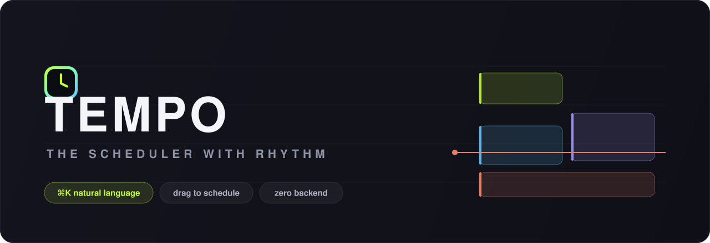

<div align="center">



<br/>

<h3>A calendar that moves at the speed of your thoughts.</h3>

<p><em>Type it. Drag it. Done.</em> No sign-up, no backend, no bloat — one HTML file that just works.</p>

<p>
  
  
  
  
</p>

<sub>Vanilla JS · localStorage · zero build step · dark-first design</sub>

</div>

---

## ✦ Why TEMPO

Most calendars make you fill out a form to book 30 minutes. TEMPO doesn't.

> **Press `⌘K`, type _"design review with Marco tomorrow 2–3:30pm"_, hit Enter.** It's on your calendar — right title, right day, right time, right color. That's the whole interaction.

It's built for the way you actually think about time: fast, in plain language, and by feel.

---

## ✦ Features

| | |
|---|---|
| ⌨️ **Natural-language quick-add** | `⌘K` and just type. Parses the title, day (`tomorrow`, `friday`, `tonight`), time ranges (`2-3:30pm`, `at 9am`), durations (`for 90m`) and even guesses a category from keywords. |
| 🎯 **Command palette** | One bar to create events, switch views, jump dates, and fuzzy-search everything you've scheduled. Fully keyboard-driven. |
| 🖱️ **Drag to schedule** | Click-drag any empty slot to block time. Drag events to move them, grab their edges to resize — all snapping to clean 15-minute steps. |
| 🧠 **Smart overlap layout** | Overlapping events auto-split into side-by-side columns, just like the calendars you pay for. |
| 📊 **Live week insights** | Committed hours, busiest day, and a load meter that warns you when the week is *"packed — protect focus time."* |
| 🌈 **Six color calendars** | Work, Deep Focus, Meetings, Personal, Health, Social — toggle any on or off in a click. |
| 🗓️ **Day / Week / 3-Day** | Plus a mini-month navigator with busy-day dots. |
| 💾 **Yours, always** | Every change auto-saves to your browser. No account, no cloud, no tracking. |
| ♿ **Accessible by design** | Visible keyboard focus, ARIA-labeled controls, and full `prefers-reduced-motion` support. |

---

## ✦ Quick start

```bash
# clone it
git clone https://github.com/yunseongkim1009/tempo.git
cd tempo

# serve it (any static server works)
python3 -m http.server 5410
```

Then open **http://localhost:5410** — and start typing.

> 💡 You can also just double-click `index.html`. Serving over HTTP is only recommended so fonts and localStorage behave consistently.

---

## ✦ Natural language, by example

TEMPO understands how people actually write:

| You type | You get |
|---|---|
| `Gym leg day tomorrow 8-9am` | **Gym leg day** · tomorrow · 8:00–9:00 AM · 🟢 Health |
| `Client call friday 10am for 45m` | **Client call** · Friday · 10:00–10:45 AM · 🔵 Meetings |
| `Dinner with Sam tonight` | **Dinner with Sam** · tonight · 7:00–8:00 PM · 🟡 Social |
| `Deep work 2-5pm` | **Deep work** · today · 2:00–5:00 PM · 🟣 Deep Focus |

---

## ✦ Keyboard shortcuts

| Key | Action | | Key | Action |
|:---:|---|---|:---:|---|
| `⌘K` / `Ctrl+K` | Open command palette | | `W` | Week view |
| `N` | New event | | `D` | Day view |
| `T` | Jump to today | | `←` `→` | Previous / next period |
| `↑` `↓` | Navigate palette | | `?` | Show shortcut hints |
| `Enter` | Create / confirm | | `Esc` | Close any dialog |

---

## ✦ Tech

Deliberately, gloriously simple:

- **One `index.html`** — markup, styles and logic in a single file
- **Vanilla JavaScript** — no framework, no bundler, no `node_modules`
- **`localStorage`** for persistence — your data never leaves the browser
- **Pure CSS** — custom-property design tokens, GPU-friendly `transform`/`opacity` animation, a dark-first system with an electric-lime signature
- **Google Fonts** — `Inter`, `Instrument Serif`, `JetBrains Mono`

No backend to deploy. No API keys. Drop it on any static host and it's live.

---

## ✦ Roadmap

- [ ] Light mode (dark-first today)
- [ ] Month view
- [ ] Recurring events
- [ ] Drag events across days
- [ ] `.ics` import / export
- [ ] Multi-week planning view

Ideas and PRs welcome.

---

<div align="center">

**Built to feel fast.** ⚡

<sub>MIT licensed — do whatever you like with it.</sub>

</div>
