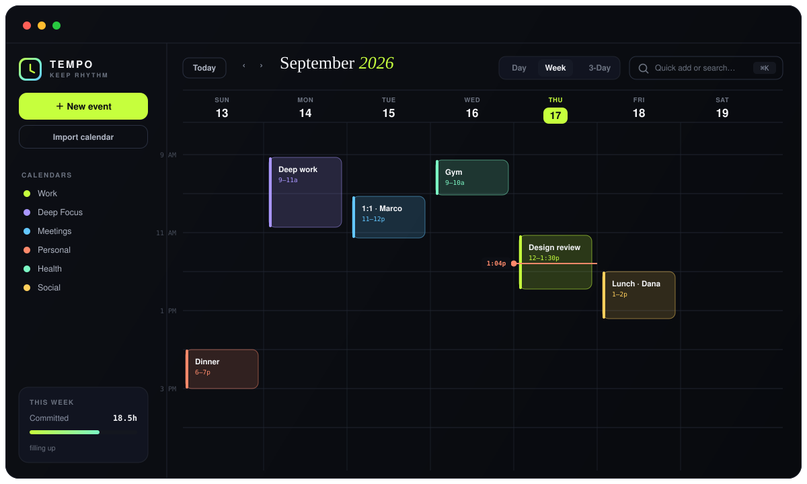

<div align="center">


<br/><br/>

### A calendar that moves at the speed of your thoughts.

<em>Type it. Drag it. Done.</em> — no sign-up, no backend, no bloat. One HTML file that just works.

<br/>

<a href="https://tempo-beta-sooty.vercel.app/"></a>


<br/><br/>

**[Features](#-features) · [Live demo](#-try-it-now) · [Quick start](#-quick-start) · [Import](#-bring-your-existing-calendar) · [Shortcuts](#-keyboard-shortcuts) · [Tech](#-tech)**

</div>

<br/>



<br/>

> **Press `⌘K`, type _“design review with Marco tomorrow 2–3:30pm”_, hit Enter.**
> It's on your calendar — right title, right day, right time, right color. That's the whole interaction.

TEMPO is built for the way you actually think about time: **fast, in plain language, and by feel.** Most calendars make you fill out a form to book 30 minutes. This one doesn't.

<br/>

## ✦ Features

<table>
<tr>
<td width="50%" valign="top">

**⌨️ Natural-language quick-add**
`⌘K` and just type. Parses the title, day (`tomorrow`, `friday`, `tonight`), time ranges (`2-3:30pm`), durations (`for 90m`), and guesses a category.

**🎯 Command palette**
One bar to create events, switch views, jump dates, and fuzzy-search everything — fully keyboard-driven.

**🖱️ Drag to schedule**
Drag any empty slot to block time. Drag events to move, grab edges to resize — snapping to clean 15-min steps.

**🧠 Smart overlap layout**
Overlapping events auto-split into side-by-side columns, like the calendars you pay for.

**📊 Live week insights**
Committed hours, busiest day, and a load meter that warns when the week is *"packed."*

</td>
<td width="50%" valign="top">

**📥 Import your calendar**
Drop an **`.ics`** file, paste an **iCal URL**, or **connect Google Calendar live**. Recurring + all-day events, locations and notes come across — re-imports never duplicate.

**🌈 Six color calendars**
Work · Deep Focus · Meetings · Personal · Health · Social — toggle any on or off in a click.

**🗓️ Day / Week / 3-Day**
Plus a mini-month navigator with busy-day dots.

**💾 Yours, always**
Auto-saves to your browser. No account, no cloud, no tracking.

**♿ Accessible by design**
Keyboard focus rings, ARIA labels, full `prefers-reduced-motion` support.

</td>
</tr>
</table>

<br/>

## ✦ Try it now

<div align="center">

### ▶ **[tempo-beta-sooty.vercel.app](https://tempo-beta-sooty.vercel.app/)**

Open it · press `⌘K` · type an event. It starts empty — it's yours to fill.

</div>

<br/>

## ✦ Quick start

```bash
git clone https://github.com/yunseongkim1009/tempo.git
cd tempo
python3 -m http.server 5410       # any static server works
```

Then open **http://localhost:5410** and start typing.

> 💡 You can even just double-click `index.html`. Serving over HTTP is only recommended so fonts and `localStorage` behave consistently.

<br/>

## ✦ Natural language, by example

TEMPO understands how people actually write:

| You type | You get |
|---|---|
| `Gym leg day tomorrow 8-9am` | **Gym leg day** · tomorrow · 8:00–9:00 AM · 🟢 Health |
| `Client call friday 10am for 45m` | **Client call** · Friday · 10:00–10:45 AM · 🔵 Meetings |
| `Dinner with Sam tonight` | **Dinner with Sam** · tonight · 7:00–8:00 PM · 🟡 Social |
| `Deep work 2-5pm` | **Deep work** · today · 2:00–5:00 PM · 🟣 Deep Focus |

<br/>

## ✦ Bring your existing calendar

Click **Import calendar** in the sidebar — three ways in:

| | |
|---|---|
| 📄 **Upload `.ics`** | Export from Google (*Settings → Import & export*), Apple (*File → Export*) or Outlook and drop the file in. Multiple at once is fine. |
| 🔗 **iCal URL** | Paste a calendar's *secret iCal address*; fetched through a public CORS proxy when the server blocks browsers. |
| 🟦 **Google (live)** | A real read-only OAuth connection. Set one Google **Client ID** once and everyone just clicks **Sign in with Google**. Data only ever lives in your browser. |

Recurring events, all-day events, locations and descriptions all come across — and importing the same source twice **won't create duplicates.**

<br/>

## ✦ Keyboard shortcuts

| Key | Action | | Key | Action |
|:---:|---|---|:---:|---|
| `⌘K` `Ctrl+K` | Command palette | | `W` | Week view |
| `N` | New event | | `D` | Day view |
| `T` | Jump to today | | `←` `→` | Prev / next period |
| `↑` `↓` | Navigate palette | | `?` | Shortcut hints |
| `Enter` | Create / confirm | | `Esc` | Close any dialog |

<br/>

## ✦ Tech

Deliberately, gloriously simple:


- **One `index.html`** — markup, styles and logic in a single file
- **Vanilla JavaScript** — no framework, no bundler, no `node_modules`
- **`localStorage`** persistence — your data never leaves the browser
- **Pure CSS** — custom-property tokens, GPU-friendly `transform`/`opacity` motion, a dark-first system with an electric-lime signature
- **Google Fonts** — `Inter`, `Instrument Serif`, `JetBrains Mono`

No backend to deploy. No API keys. Drop it on any static host and it's live.

<br/>

## ✦ Roadmap

- [x] `.ics` import + live Google Calendar connect
- [ ] `.ics` export (round-trip)
- [ ] Month view
- [ ] Light mode
- [ ] Drag events across days
- [ ] Multi-week planning view

Ideas and PRs welcome.

<br/>

<div align="center">

**Built to feel fast.** ⚡

<sub>MIT licensed — do whatever you like with it. · Made with an unreasonable amount of care.</sub>

</div>
